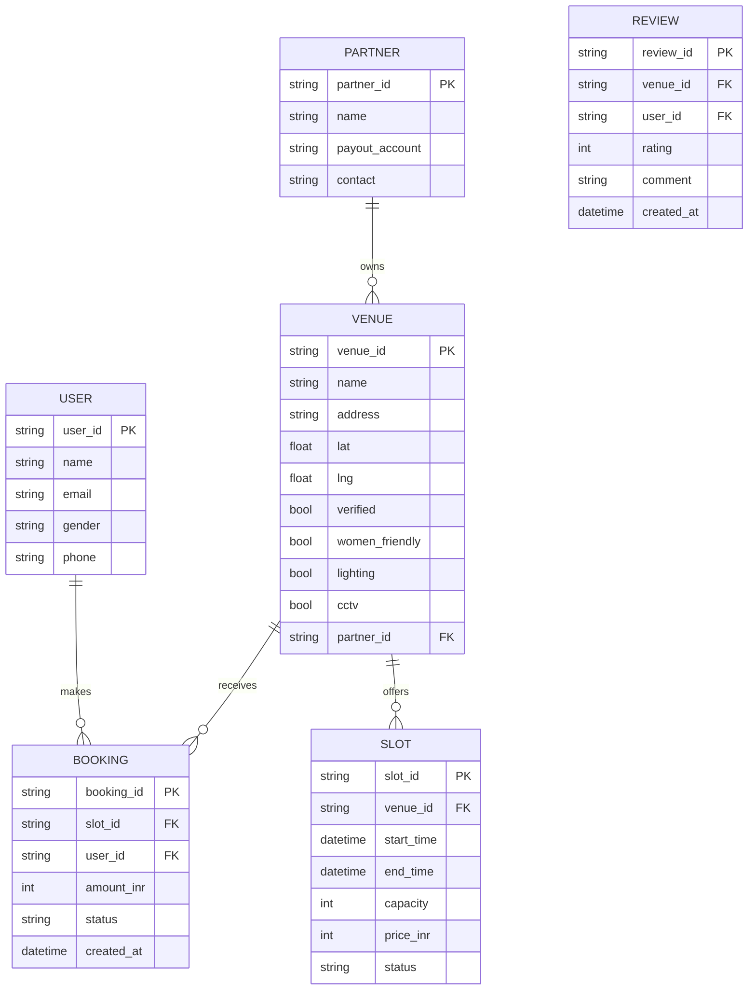

# Logical Data Model (v1)

```mermaid
erDiagram
    USER ||--o{ BOOKING : makes
    USER {
      string user_id PK
      string name
      string email
      string gender
      string phone
    }
    VENUE ||--o{ SLOT : offers
    VENUE ||--o{ BOOKING : receives
    VENUE {
      string venue_id PK
      string name
      string address
      float  lat
      float  lng
      bool   verified
      bool   women_friendly
      bool   lighting
      bool   cctv
      string partner_id FK
    }
    SLOT {
      string slot_id PK
      string venue_id FK
      datetime start_time
      datetime end_time
      int capacity
      int price_inr
      string status
    }
    BOOKING {
      string booking_id PK
      string slot_id FK
      string user_id FK
      int amount_inr
      string status
      datetime created_at
    }
    PARTNER ||--o{ VENUE : owns
    PARTNER {
      string partner_id PK
      string name
      string payout_account
      string contact
    }
    REVIEW {
      string review_id PK
      string venue_id FK
      string user_id FK
      int rating
      string comment
      datetime created_at
    }
```
