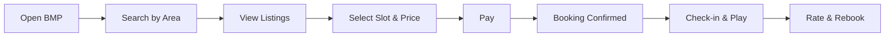

# PRD — BookMyPlay MVP

## 1. Problem & Goals
**Problem**: Players can’t reliably find and book nearby, affordable, and safe grounds; schools lack an easy way to monetize idle capacity.

**Goals (v1)**
- Let users discover nearby grounds, view transparent pricing/slots, and book in < 3 minutes.
- Onboard 10–15 school venues with verifiable details and payout automation.
- Achieve ≥ 30% first-to-booking conversion for acquired users in pilot zones.
- Hit Net CSAT ≥ 4.4/5 and refund rate ≤ 5% in pilot.

## 2. Non-goals (v1)
- Coaching marketplace, tournaments marketplace, or equipment rentals (beyond trials).
- Dynamic pricing based on demand (v2+).
- In-app chat between teams (v2).

## 3. Users
- Players (students/young professionals)
- School Admins (venue partners)
- Coaches/Academies (secondary)

## 4. User Stories (selected)
- As a player, I can filter by distance/price/time and book a slot online.
- As a player, I can see safety indicators (lighting, CCTV, women-friendly) and reviews.
- As a school admin, I can upload photos, set slots/prices, and receive payouts weekly.
- As an admin, I can handle cancellations/refunds with consistent rules.

## 5. Flows

## 6. Requirements
**Functional**
- Geo search; filters (distance, price, sport, time).
- Venue pages: photos, amenities, safety indicators, reviews.
- Booking: slot calendar, online payment, confirmation.
- Cancellations/refunds with clear policy; waitlist optional.
- Venue onboarding: add/edit listing, slot mgmt, pricing, payout profile.
- Admin dashboard: bookings, refunds, payouts, support.

**Non-functional**
- P0 uptime for booking flow; retries for payment webhooks.
- PII handling, GDPR-like consent; secure payout processing.
- Observability: event logging, alerting on payment/booking drop-offs.

## 7. Measurement (per **ANALYTICS_PLAN.md**)
- Funnel: Search→Listing→Slot→Pay Success
- MPPS, Slot Fill Rate, D30 repeat rate, CSAT, Refund Rate

## 8. Release Plan
- Pilot 1 (Zone A): 5–8 schools, 4 weeks, success criteria: MPPS≥300, CSAT≥4.4.
- Pilot 2 (Zone B): 8–12 schools, 4–6 weeks, success criteria: MPPS≥500, D30 repeat≥25%.
- Rollout: add payments v2, waitlist auto-fill, referral engine.
