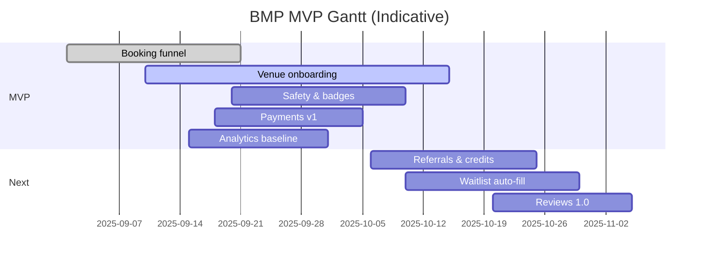

# Roadmap (Now / Next / Later)

## Now (0–6 weeks)
- MVP booking funnel (search, listing, slot, pay)
- Venue onboarding portal (CSV import)
- Verified safety checklist & badges
- Payments v1; refunds policy
- Analytics & dashboard (core events)

## Next (6–12 weeks)
- Referrals & credits
- Waitlist auto-fill & overbooking controls
- Reviews 1.0; image moderation
- Partner payout automation
- Basic notifications (reminders, receipts, incident flow)

## Later (12+ weeks)
- Dynamic pricing, inventory calendars v2
- Block bookings for academies
- Team formation & chat
- Sponsorships/brand tie-ins

